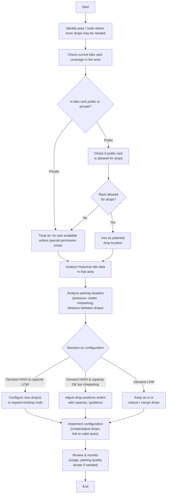

```mermaid
flowchart TD

    A["Start"] --> B["Identify area / node where more drops may be needed"]

    B --> C["Check current bike rack coverage in the area"]

    C --> D{"Is bike rack public or private?"}

    D -->|Public| E["Check if public rack\nis allowed for drops"]
    D -->|Private| F["Treat as 'no rack available'\nunless special permission exists"]

    E --> G{"Rack allowed\nfor drops?"}
    G -->|Yes| H["Use as potential\ndrop location"]
    G -->|No| F

    F --> I["Analyze historical ride data\nin that area"]
    H --> I

    I --> J["Analyze parking situation\n(pressure, clutter, misparking,\ndistance between drops)"]

    J --> K{"Decision on configuration"}

    K -->|Demand HIGH & capacity LOW| L["Configure new drop(s)\nor expand existing node"]
    K -->|Demand HIGH & capacity OK but misparking| M["Adjust drop positions and/or\nadd capacity / guidance"]
    K -->|Demand LOW| N["Keep as is or\nreduce / merge drops"]

    L --> O["Implement configuration\n(create/adjust drops,\nlink to valid racks)"]
    M --> O
    N --> O

    O --> P["Review & monitor\n(usage, parking quality,\niterate if needed)"]

    P --> Q["End"]
```
