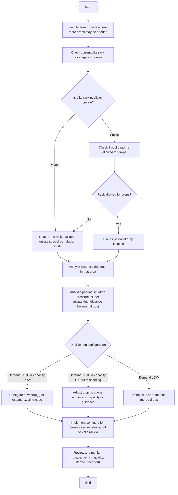

```mermaid
flowchart TD

    A["Start"] --> B["Identify area or node where more drops may be needed"]

    B --> C["Check current bike rack coverage in the area"]

    C --> D{"Is bike rack public or private?"}

    D -->|Public| E["Check if public rack is allowed for drops"]
    D -->|Private| F["Treat as 'no rack available' unless special permission exists"]

    E --> G{"Rack allowed for drops?"}
    G -->|Yes| H["Use as potential drop location"]
    G -->|No| F

    F --> I["Analyze historical ride data in that area"]
    H --> I

    I --> J["Analyze parking situation (pressure, clutter, misparking, distance between drops)"]

    J --> K{"Decision on configuration"}

    K -->|Demand HIGH & capacity LOW| L["Configure new drop(s) or expand existing node"]
    K -->|Demand HIGH & capacity OK but misparking| M["Adjust drop positions and/or add capacity or guidance"]
    K -->|Demand LOW| N["Keep as is or reduce or merge drops"]

    L --> O["Implement configuration (create or adjust drops, link to valid racks)"]
    M --> O
    N --> O

    O --> P["Review and monitor (usage, parking quality, iterate if needed)"]

    P --> Q["End"]
```
