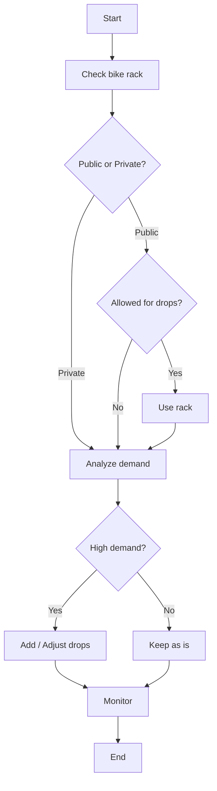

```mermaid
flowchart TD
    A[Start] --> B[Check bike rack]
    B --> C{Public or Private?}
    C -->|Public| D{Allowed for drops?}
    C -->|Private| E[Analyze demand]
    D -->|Yes| F[Use rack]
    D -->|No| E
    F --> E
    E --> G{High demand?}
    G -->|Yes| H[Add / Adjust drops]
    G -->|No| I[Keep as is]
    H --> J[Monitor]
    I --> J
    J --> K[End]
```
